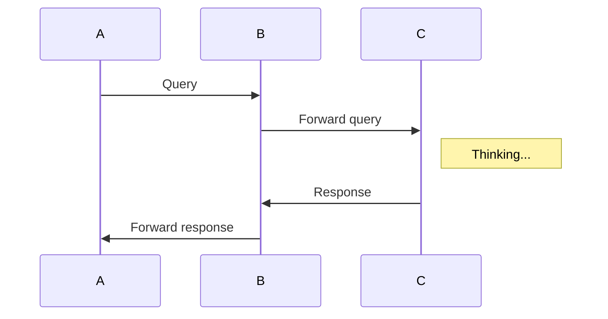
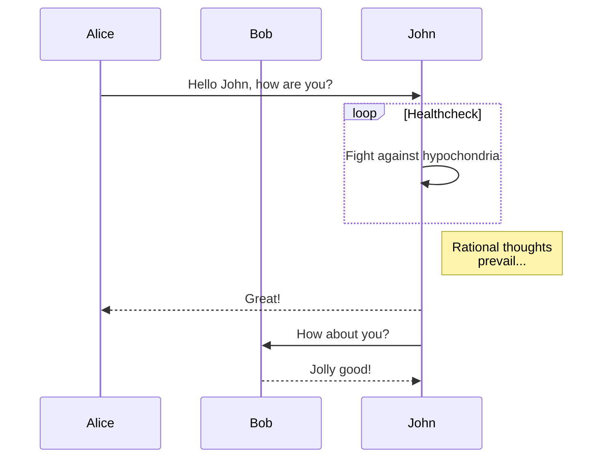

# mermaid-diagrams
A simple chrome extension to add support for [mermaid](http://knsv.github.io/mermaid/index.html) syntax in github pages.

For example add this to any wiki page or markdown file in github





This will generate a nice diagram if loaded from github. The extension will just replace the code block with the generated [mermaid](http://knsv.github.io/mermaid/index.html) diagram.

## Instructions to install it

### From [ChromeStore](https://chrome.google.com/webstore/detail/mermaid-diagrams/phfcghedmopjadpojhmmaffjmfiakfil)

Just click the link above and follow the instructions

### From source

1. Enable developer mode in chrome://extensions
2. Clone the repo
   ```bash
   git clone https://github.com/Redisrupt/mermaid-diagrams
   ```
3. Click on load unpacked extension
4. Select the extensions folder inside the recently cloned repo

Done!

Navigate to any page in github with mermaid syntax blocks to see the extension in action

